# vim 笔记

## vim 初始化

- `vim -u NONE -N` 此命令可以使vim进入初始化的状态

- ```vim
  set nocompatible 
  filetype plugin on
  ```
  
  此命令脚本可以开启最小插件配置，保存上面的脚本到code/essential.vim.启动的时候使用下面的命令 `vim -u code/essential.vim`

## 1. vim解决问题的方式

- `.`命令，做重复的修改 `>G`缩进文档里面的所有内容

-   一些常用的命令组合和简化形式    

| 复合命令 | 等效长命令 |
| ---- | ----- |
| C    | c$    |
| s    | cl    |
| S    | ^c    |
| I    | ^i    |
| A    | $a    |
| o    | A<CR> |
| O    | ko    |

- `;`命令当用f命令查找之后可以快速查找到下一个字符

可以重复的操作和回退

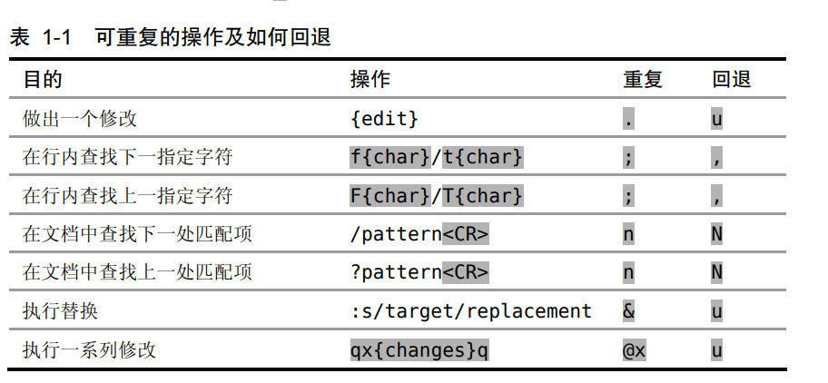

- `*`查找当前光标下的单词

## 2. 普通模式

- 删除一个单词，`daw`更好，只是一个操作可以用.命令做重复的修改

- <C-a> <C-x>对数字进行加减`10<C-a>`可以做5次加法  对数字007做加法会变成010，这是8进制的加法，可以通过在vimrc里面设置`set nrformats`来屏蔽

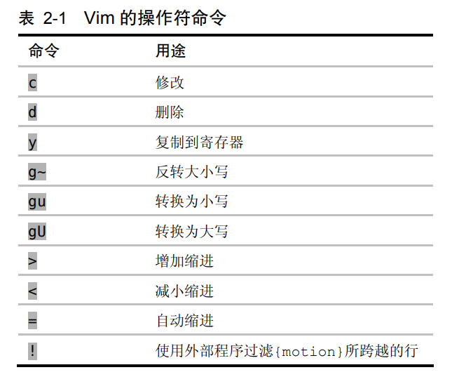

## 3. 插入模式

- 插入模式中好用的快捷键

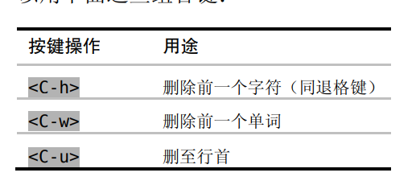

- 模式切换快捷键

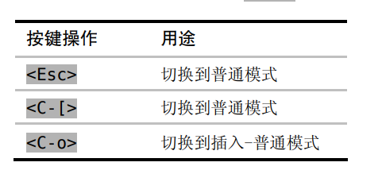

- 粘贴寄存器中的文本 `<C-r{register}`

- 表达式寄存器 `<C-r>=` 可以执行Vim脚本或者数学运算 <C-r>=6*35 结果是210

- 替换模式替换已有的文本命令`R` 

## 4. 可视模式

- 三种不同的切换，`o`可以切换选区的活动端

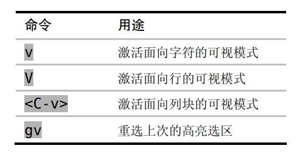

- 长短不一的高亮快添加文本。

```
<C-v>jj$
A;
<Esc>
列选择，然后移动到行尾，然后插入字符
```

## 5. 命令行模式

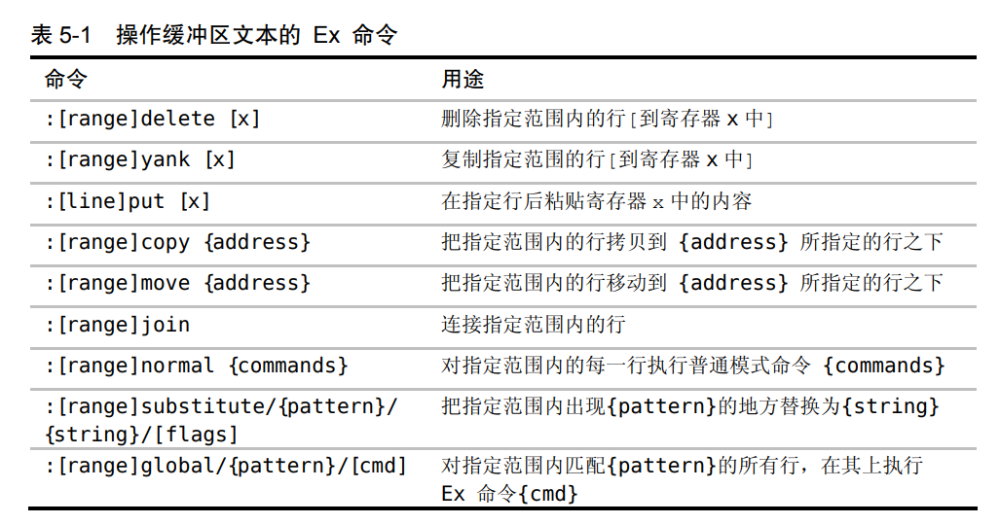

- 指定范围 `{start},{end}`可以指定行的范围，`.` 代表当前行，`%` 代表所有行start和end也可以是模式，比如，`/<html>/,/<\/html>/` 地址可以指定偏移，`:{addr}+n` 

常用地址的说明：

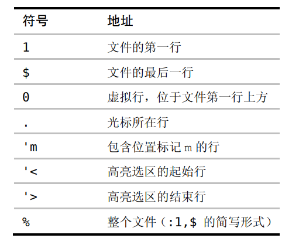

- `:copy or :t` 复制行，有如下的命令，命令格式`:[range]copy {address}` 

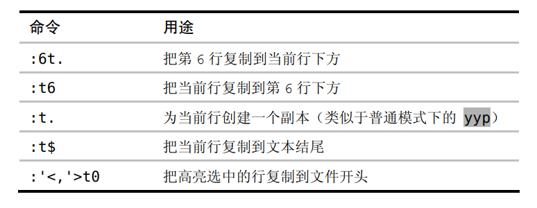

- :move 命令移动行

- :normal cmd 可以在指定范围上执行命令 `:<range>normal .` 重复执行上一步的命令

- 重复上次的命令 @: 回退命令:bprevious  更好的回退命令<C-o>  配合技巧36的时候再看一下

- 命令自动补全<C-d>列出所有的命令，<tab>自动补全命令

- 插入当前单词<c-r><c-w>

- 命令行窗口 q: 可以编辑命令

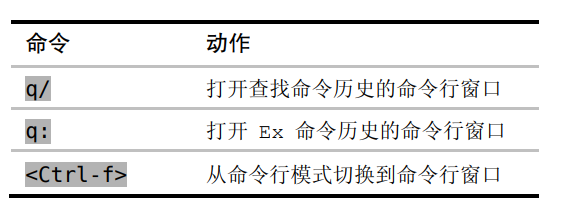

- 执行shell中的命令 `!cmd` %代表当前的文件名。`:shell` 提供一个交互式的shell会话<C-z>会后台运行vim程序，使用jobs查看所有的后台程序，fg命令可以让程序前置

- `read !{cmd}` 读取cmd命令输出到缓冲区，`:write !sh` 缓冲区内容作为cmd命令的标准输入。`write! sh` 缓冲区内容保存到sh名字的文件中

- `[range]!{filter}` 命令可以过滤范围中的选中区的内容，读取其中的内容，并把结果作为输出。`2,$!sort -t',' -k2` 过滤范围中的字段，并按照第二个关键字排序。可以使用`!{motion}` 模式快速切换到命令行模式

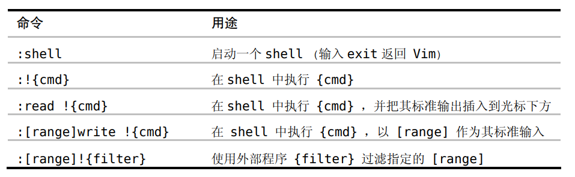

## 6. 管理多个文件

- 缓冲区管理文件 `vim *.txt` 读取txt文件到缓冲区. `:ls` 查看打开的文件. `:bnext` 切换缓冲区列表的下一个.`<C-^>` 可以轮换到下一个缓冲区, `#` 代表可以轮换的文件列表
- `bprev` 和 `bnext` 在列表中正向和反向移动。`:bfirst和:blast` 可以跳到列表的开头和结尾.`:buffer {buffername} or :buffer {N}` 可以根据名字和编号找到下一个缓冲区。`bufdo和argdo` 可以在缓冲区执行Ex命令
- `bdelete N1 N2 N3 和 N,M bdelete` 可以删除缓冲区. `badd filename` 添加文件到缓冲区。
- `:args {argslist}` 设置参数列表的内容，可以是通配符。**通配符可以匹配子目录

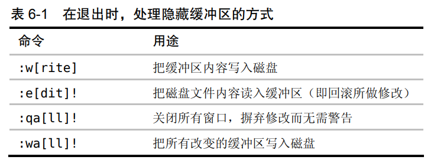

- `argdo {cmd}` 对参数列表中的所有的缓冲区执行命令

- <C-w>s和<C-w>v分割窗口，上下分割和左右分割

- 窗口的一些操作

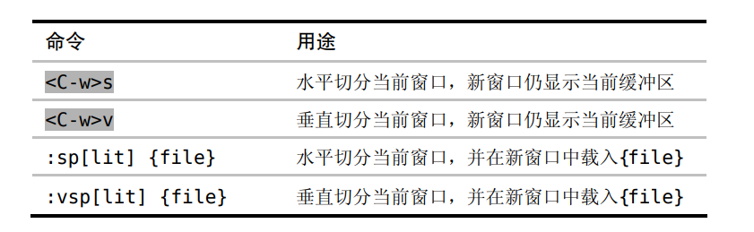

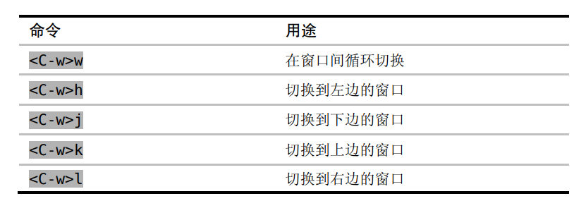

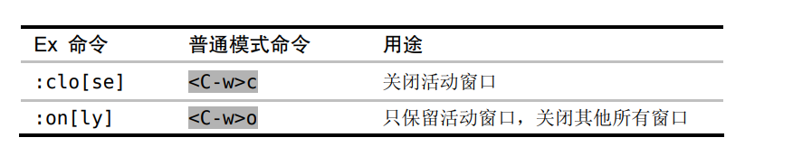

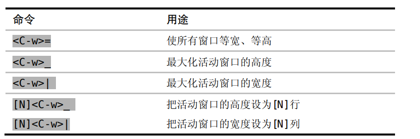

- 使用标签页。`lcd {path}` 设置当前窗口的本地工作目录  `windo lcd {path}` 为所有的窗口设置本地工作目录

- 标签页的一些操作

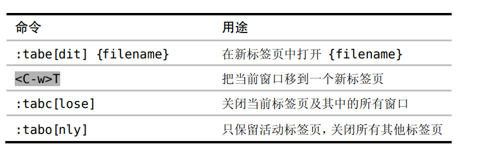

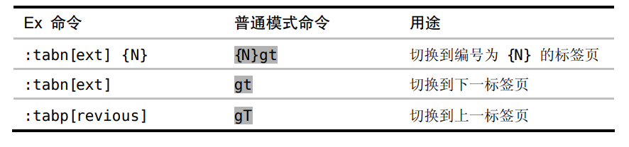

- `tabmove [N]` 此命令可以重排标签页，N为0的时候此标签页会移动到开头，省略了N会移动到结尾。

## 7. 打开保存文件

- edit命令可以打开文件。edit %:h<Tab>会自动展开当前文件所在的目录

- :find命令打开文件，需要首先设置path路径。:set path+=app/** ,其中**代表子目录

- vim <dir>会打开一个目录管理器

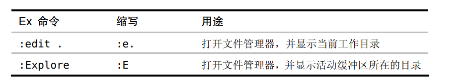

## 8. 动作命令移动

- 对屏幕行的操作

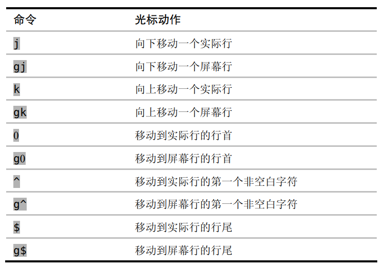

- 基于单词移动。word是单词WORD是字符串，WBEgE，命令可以在字串上移动

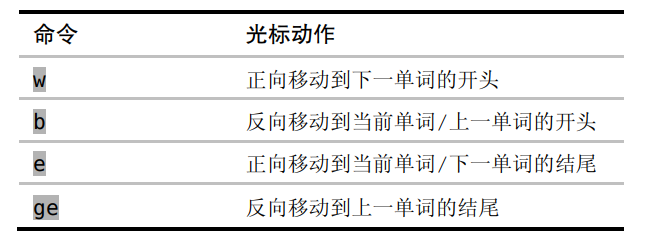

- 字符串进行查找`f{char} ,;` 可以回退和前进

-  


